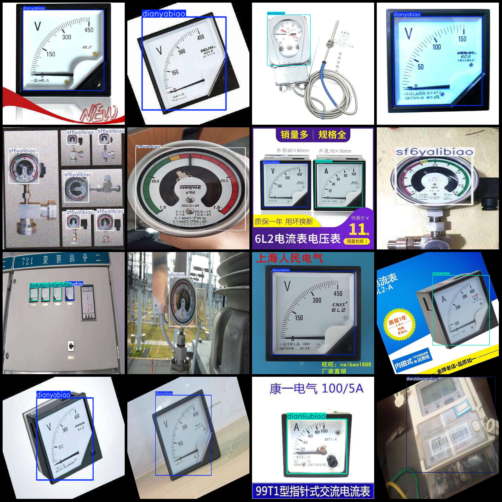
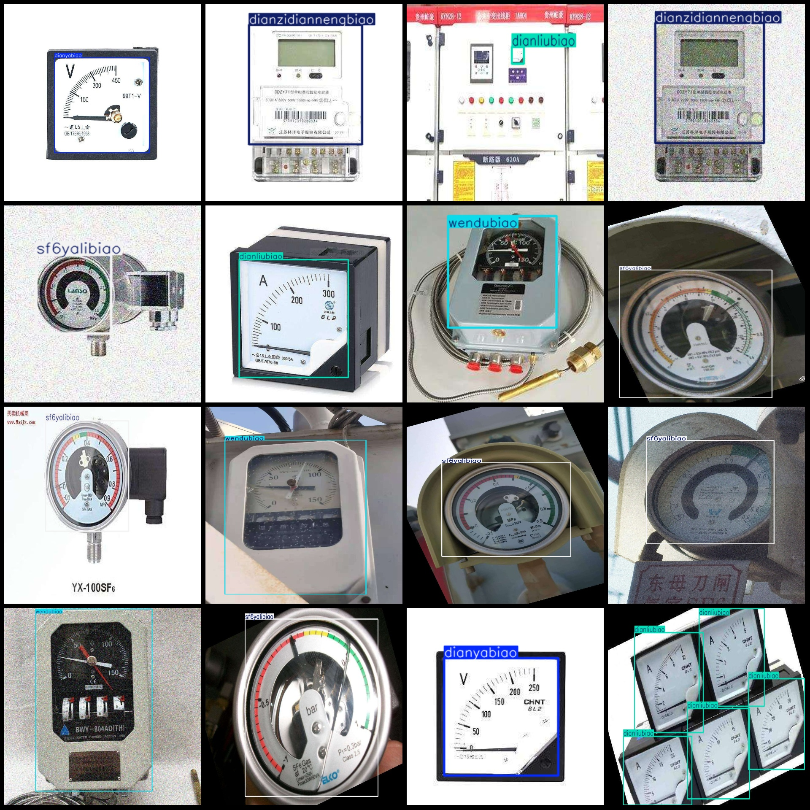

# Power Scene Instruments: Current, Voltage, Temperature, Pressure Data Set in VOC+YOLO Format with 3216 Images for 5 Categories

The dataset format is Pascal VOC format + YOLO format (without split paths in the txt file, only containing jpg images and corresponding VOC format xml files and yolo format txt files).

Number of images: 3216
Number of annotations: 3216
Number of annotation files: 3216
Number of annotation categories: 5
Annotation category names: ["dianliubiao", "dianyabiao", "dianzidiannengbiao", "sf6yalibiao", "wendubiao"]
["Current Meter", "Voltage Meter", "Electronic Power Meter", "SF6 Pressure Gauge", "Temperature Gauge"]
Number of bounding boxes for each category:
dianliubiao = 1443
dianyabiao = 1006
dianzidiannengbiao = 1264
sf6yalibiao = 844
wendubiao = 455
Total bounding box count: 5012
Number of images each category occupies:
dianliubiao = 869
dianyabiao = 849
dianzidiannengbiao = 630
sf6yalibiao = 748
wendubiao = 396
Image resolution: Multi-resolution images, such as 1920x3415, 750x685, etc.
Using labelImg for annotation: Yes
Annotation rules: Draw a rectangle around the category.
Important note: The dataset does not have been split into training, validation, or test sets; you should do so yourself.
Special notice: This dataset does not guarantee the accuracy of the trained model or weight files.
Image preview:

Here is a pay link on Stripe ( https://buy.stripe.com/3cs8yP7sY87d0vu9AB ). Please contact me lonlonago@foxmail.com after funding $89, and I will send you a complete data files , thank you!

